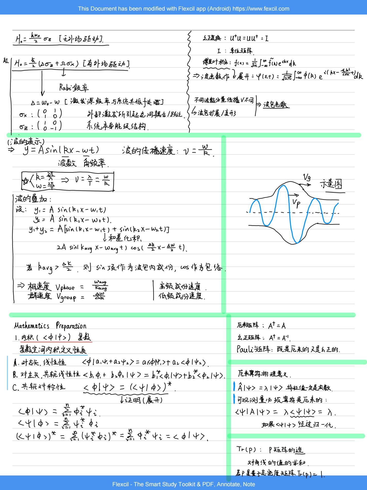
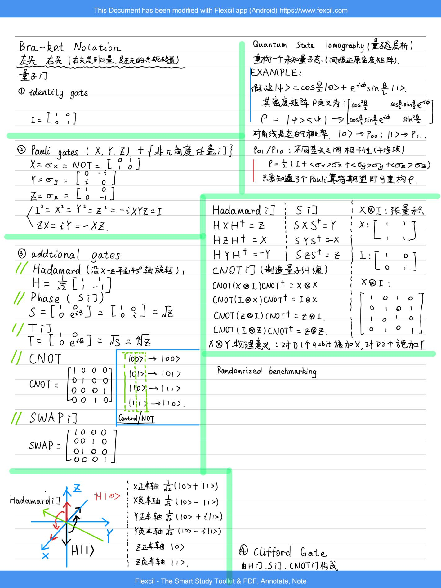
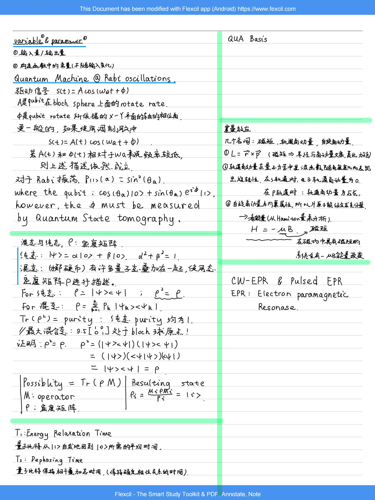
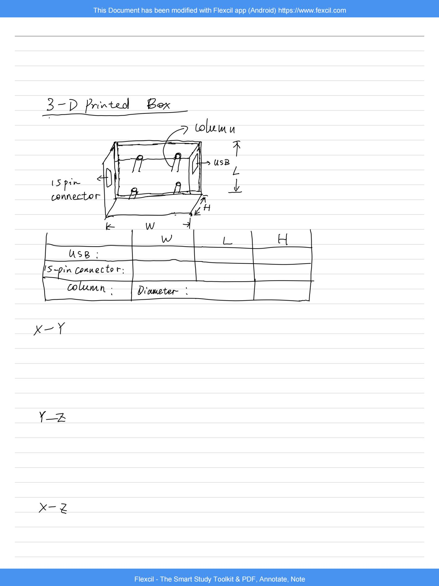

Here are some of my hobbies:

- 🎵 Playing the piano (Professional Level 8)
- 📸 Photography (Nikon D750)
- 🏎️ Watching sports (Formula 1, Football)
- 🧋 Exploring different restaurants (Chinese cuisine, Western food)

---

### 📘 Recent Interest

Recently, I’ve been working on compiling a **laboratory study manual**, documenting what I have gained from the experience working as an intern at EQSL.

Here’s a preview of some of the content:
 
 
 
 
 

